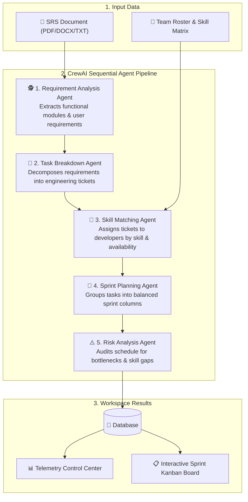
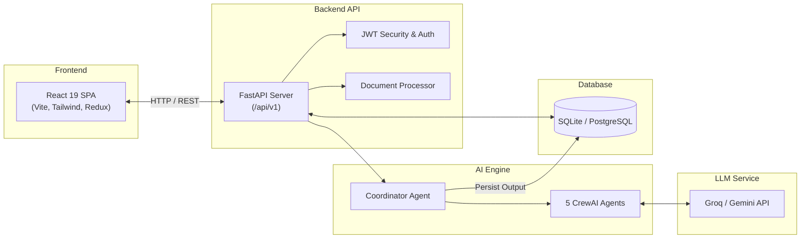

# AgentHive 

> **Multi-Agent AI Sprint Planning Assistant**

AgentHive is an open-source, full-stack application that transforms raw Software Requirement Specifications (SRS) into structured, role-matched, balanced sprint plans using a coordinated pipeline of **5 specialized CrewAI agents**.

[](https://react.dev/)
[](https://www.typescriptlang.org/)
[](https://fastapi.tiangolo.com/)
[](https://www.python.org/)
[](https://www.crewai.com/)
[](https://www.sqlalchemy.org/)

---

## 📌 Table of Contents

- [Overview](#-overview)
- [How It Works](#-how-it-works)
- [Multi-Agent Pipeline](#-multi-agent-pipeline)
- [Features](#-features)
- [Tech Stack](#-tech-stack)
- [System Architecture](#-system-architecture)
- [Folder Structure](#-folder-structure)
- [Getting Started](#-getting-started)
  - [Prerequisites](#prerequisites)
  - [Backend Setup](#1-backend-setup)
  - [Frontend Setup](#2-frontend-setup)
- [Environment Variables](#-environment-variables)
- [API Reference](#-api-reference)
- [Testing](#-testing)
- [Roadmap & Future Enhancements](#-roadmap--future-enhancements)
- [License](#-license)

---

## 🌟 Overview

### What is AgentHive?

**AgentHive** simplifies and automates software project planning. By ingesting raw project requirement documents (PDF, DOCX, TXT) and team skill profiles, AgentHive runs an autonomous multi-agent pipeline to generate comprehensive sprint roadmaps, engineering tickets, skill-matched developer assignments, and schedule risk audits.

### The Problem It Solves

Sprint planning and backlog grooming traditionally require hours of manual work from engineering managers and technical leads:
- Deconstructing lengthy requirements into granular user stories and tickets.
- Estimating technical complexity, story points, and required developer skill sets.
- Balancing individual team workload while minimizing delivery bottlenecks.

AgentHive automates this workflow end-to-end, serving as a virtual Project Management Office (PMO) with live execution telemetry, visual Kanban boards, and actionable risk analysis.

---

## 🔄 How It Works

1. **Create a Project Workspace**: Initialize a project container to organize requirements, team rosters, and generated plans.
2. **Upload Requirement Specifications (SRS)**: Upload requirement documents in PDF, DOCX, or plain text format.
3. **Configure Team Skill Profiles**: Define team members, their roles, and specific technical skills with proficiency levels.
4. **Trigger the AI Pipeline**: Launch the 5-agent CrewAI pipeline from the **AI Control Center** and monitor step-by-step progress in real time.
5. **Review & Execute**: View structured engineering tasks, developer assignments, sprint capacity columns, and risk audit recommendations on the interactive Dashboard.

---

## 🤖 Multi-Agent Pipeline

AgentHive orchestrates **5 sequential CrewAI agents**, passing structured context downstream at each stage:



| # | Agent | Role | Output Artifact |
|---|---|---|---|
| **1** | **Requirement Analysis Agent** | Business Analyst | Functional modules, feature specifications, and requirements list |
| **2** | **Task Breakdown Agent** | Technical Lead | Granular engineering tickets with complexity & story point estimates |
| **3** | **Skill Matching Agent** | Engineering Manager | Developer-to-task assignments based on skill requirements & seniority |
| **4** | **Sprint Planning Agent** | Agile Scrum Master | Balanced sprint roadmap adhering to story point capacity limits |
| **5** | **Risk Analysis Agent** | Solutions Risk Auditor | Comprehensive risk audit, bottleneck detection, and mitigation strategies |

---

## ✨ Features

- **🔐 User Authentication**: Secure registration and login using JWT tokens and bcrypt password hashing.
- **📄 Multiformat SRS Parser**: Document text extraction from PDF, DOCX, and TXT files using PyMuPDF and python-docx.
- **👥 Team Skill Matrix**: Developer profiles with role assignments, skill tagging, and 5-tier proficiency levels.
- **🤖 5-Agent CrewAI Orchestrator**: Automated multi-agent workflow powered by Groq (Llama 3.3) or Google Gemini.
- **📊 Real-Time AI Control Center**: Live telemetry dashboard tracking execution states, individual agent runtimes, logs, and JSON payloads.
- **📋 Sprint Board & Analytics**: Interactive sprint Kanban interface with data visualization powered by Recharts.
- **⚠️ Automated Risk Auditing**: Automated detection of skill deficits, single points of failure, and workload over-allocations.

---

## 🛠️ Tech Stack

| Domain | Technologies |
|---|---|
| **Frontend** | React 19, TypeScript 6.0, Vite 8, React Router v7, Redux Toolkit |
| **Styling** | Tailwind CSS v4, PostCSS, Lucide React Icons |
| **Data Viz & Forms** | Recharts, React Hook Form |
| **Backend Framework** | FastAPI 0.139, Python 3.11+, Uvicorn |
| **ORM & Database** | SQLAlchemy 2.0, SQLite (default local DB) / PostgreSQL supported |
| **AI Orchestration** | CrewAI 1.6, LiteLLM, LangChain |
| **Supported LLMs** | Groq (`llama-3.3-70b-versatile`), Google Gemini (`gemini-1.5-flash`) |
| **Document Processing** | PyMuPDF (`fitz`), `python-docx` |
| **Security & Testing** | JWT Tokens, Bcrypt, Pytest, FastAPI TestClient |

---

## 🏗️ System Architecture



---

## 📁 Folder Structure

```
AgentHive/
├── backend/
│   ├── app/
│   │   ├── agents/            # 5 CrewAI agents + Coordinator orchestrator
│   │   ├── api/routes/        # REST endpoints (auth, projects, team, AI, analytics)
│   │   ├── core/              # Security, settings, and logging configuration
│   │   ├── database/          # Engine setup & DB sessions
│   │   ├── models/            # SQLAlchemy database models
│   │   ├── schemas/           # Pydantic data validation schemas
│   │   ├── services/          # Document processing & business logic
│   │   └── main.py            # FastAPI entry point
│   ├── tests/                 # Integration tests (pytest)
│   ├── uploads/               # Uploaded SRS files
│   └── requirements.txt
│
└── frontend/
    └── src/
        ├── api/               # Axios client configuration
        ├── components/        # Reusable UI components & route guards
        ├── pages/             # Auth, Projects, Team Panel, AI Center, Dashboard
        ├── redux/             # Redux Toolkit state management
        ├── routes/            # React Router paths
        └── App.tsx            # Main application wrapper
```

---

## 🚀 Getting Started

### Prerequisites

- **Python**: `3.10` or higher
- **Node.js**: `18.0.0` or higher
- **LLM API Key**: A free key from [Groq Console](https://console.groq.com/) or [Google AI Studio](https://aistudio.google.com/).

---

### 1. Backend Setup

1. **Navigate to the backend directory**:
   ```bash
   cd backend
   ```

2. **Create and activate a virtual environment**:
   - *Windows (PowerShell)*:
     ```powershell
     python -m venv .venv
     .\.venv\Scripts\activate
     ```
   - *macOS / Linux*:
     ```bash
     python3 -m venv .venv
     source .venv/bin/activate
     ```

3. **Install dependencies**:
   ```bash
   pip install -r requirements.txt
   ```

4. **Set up environment variables**:
   Copy the example environment file:
   ```bash
   cp .env.example .env
   ```
   Edit `.env` and add your API key:
   ```env
   LLM_PROVIDER=groq
   GROQ_API_KEY=gsk_your_groq_api_key_here
   ```

5. **Start the server**:
   ```bash
   uvicorn app.main:app --reload
   ```
   - API server: `http://localhost:8000`
   - Swagger documentation: `http://localhost:8000/docs`

---

### 2. Frontend Setup

1. **Open a new terminal and navigate to the frontend directory**:
   ```bash
   cd frontend
   ```

2. **Install Node dependencies**:
   ```bash
   npm install
   ```

3. **Start the development server**:
   ```bash
   npm run dev
   ```
   - Web App URL: `http://localhost:5173`

---

## ⚙️ Environment Variables

Configuration options for `backend/.env`:

| Variable | Description | Default |
|---|---|---|
| `LLM_PROVIDER` | Active LLM provider (`groq` or `google`) | `groq` |
| `GROQ_API_KEY` | Groq Cloud API key | `None` |
| `GROQ_MODEL` | Groq LLM model name | `llama-3.3-70b-versatile` |
| `GEMINI_API_KEY` | Google Gemini API key | `None` |
| `GEMINI_MODEL` | Gemini model name | `gemini-1.5-flash` |
| `DATABASE_URL` | SQLAlchemy connection string | `sqlite:///./agenthive.db` |
| `SECRET_KEY` | Secret key for JWT signing | `CHANGE_ME_IN_PRODUCTION` |
| `CORS_ORIGINS` | Allowed CORS origin endpoints | `http://localhost:5173` |

---

## 📡 API Reference

All endpoints use the `/api/v1` prefix.

| Category | Method | Endpoint | Description |
|---|---|---|---|
| **Auth** | `POST` | `/auth/register` | Register a new user account |
| **Auth** | `POST` | `/auth/login` | Authenticate & obtain JWT token |
| **Auth** | `GET` | `/auth/me` | Fetch current user profile |
| **Projects** | `GET` | `/projects/` | List user projects |
| **Projects** | `POST` | `/projects/` | Create a new project workspace |
| **Projects** | `GET` | `/projects/{id}` | Get project details |
| **Pipeline** | `POST` | `/projects/{id}/srs` | Upload SRS file or plain text |
| **Pipeline** | `POST` | `/projects/{id}/pipeline` | Run full 5-agent pipeline |
| **Team** | `GET` | `/team/members` | Get team roster & skills |
| **Team** | `POST` | `/team/members` | Add new developer profile |
| **AI Center** | `GET` | `/ai/logs/{project_id}` | Fetch agent telemetry & run logs |
| **AI Center** | `GET` | `/ai/recommendations/{project_id}` | Fetch risk audit recommendations |

---

## 🧪 Testing

Run automated integration tests using Pytest:

```bash
cd backend
pytest
```

The test suite validates authentication endpoints, user registration, JWT lifecycle, and full project CRUD operations.

---

## 🎯 Roadmap & Future Enhancements

- [ ] Jira / GitHub Issues export integration
- [ ] WebSocket streaming for agent progress logs
- [ ] PostgreSQL deployment configuration
- [ ] Customizable agent prompts and team story point capacities

---

